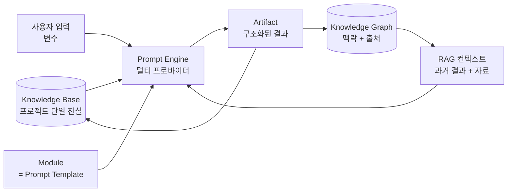

# SOS — Startup Operating System · 설계 문서 패키지

> AI가 전략 컨설턴트·투자 심사역·PM·시장조사원 역할을 수행하며, **아이디어 검증부터 사업계획서 작성까지를 하나의 워크플로우로 연결**하는 창업 운영 SaaS.

이 폴더는 SOS를 **실제 Production 수준으로 구현**하기 위한 설계 문서 패키지입니다. 1인 개발 / 빠른 MVP 기준으로 작성되었으며, 각 문서는 바로 개발에 착수할 수 있도록 스키마·계약(contract)·코드 스니펫을 포함합니다.

---

## 0. 이 패키지를 읽는 순서

| # | 문서 | 무엇을 다루나 | 누가 먼저 보면 좋나 |
|---|------|--------------|---------------------|
| 00 | **README** (이 문서) | 전체 개요, 핵심 멘탈 모델, 용어 사전, 문서 지도 | 모두 |
| 01 | [PRD](./01-PRD.md) | 비전·페르소나·문제·기능 정의·MVP 범위·성공지표 | 기획/의사결정 |
| 02 | [Architecture](./02-architecture.md) | 기술 스택 근거, 시스템 구조, 폴더 구조, 보안, 배포 | 개발 착수 전 |
| 03 | [Database Schema](./03-database-schema.md) | Postgres 스키마, ERD, RLS, pgvector(RAG) | DB 구축 |
| 04 | [API Design](./04-api-design.md) | Server Actions/Route Handlers, 계약, 스트리밍, 에러 모델 | 백엔드 |
| 05 | [AI Prompt Engine](./05-ai-prompt-engine.md) | **(핵심)** Prompt Builder, 멀티 프로바이더 추상화, RAG, Workflow, Reviewer | 가장 먼저 정독 |
| 06 | [UX & Screens](./06-ux-and-screens.md) | Workspace IA, 화면 정의, 디자인 시스템, Command Palette | 프론트엔드 |
| 07 | [Roadmap](./07-roadmap.md) | 1인 MVP 8주 실행 계획, 컷라인, 비용 모델, 런치 체크리스트 | 실행 시작 |
| 08 | [Human-in-the-Loop](./08-human-in-the-loop.md) | AI·인간 역할 경계, Decision Gate·검증 상태, 휴먼 터치 지점 | 신뢰·검증 설계 |

**최단 경로(바로 만들고 싶다면):** 05 → 03 → 02 → 07 순으로 읽고 Phase 0부터 착수.

---

## 1. 핵심 멘탈 모델 — "모든 것은 Module이다"

SOS의 모든 기능(Idea Lab, Research, Validation, Analysis, Documents)은 표면적으로 달라 보이지만, **단 하나의 원시 개념(primitive)** 위에 세워집니다. 이것이 "Prompt First · Modular" 철학을 코드로 구현한 형태이며, 이 설계 전체의 척추입니다.

```
Module = Prompt Template + Input Schema + Output Schema
Run    = Module 를 (Knowledge Base + RAG 컨텍스트 + 사용자 입력) 에 대해 1회 실행한 것
Artifact = Run 의 구조화된 결과물 (분석 결과 / 문서 섹션 / 문서)
```

즉 SWOT도, TAM-SAM-SOM도, SCAMPER도, "사업계획서 생성"도 전부 같은 실행 파이프라인을 탑니다. 차이는 **데이터(템플릿 정의)**일 뿐 **코드가 아닙니다**. 새 분석 프레임워크 추가 = 템플릿 레코드 1개 추가. 이것이 SOS가 "GPT 프롬프트 모음집"이 아니라 **플랫폼**인 이유입니다.



이 루프가 닫혀 있다는 점이 중요합니다. 결과물(Artifact)이 다시 Knowledge Base와 Knowledge Graph로 흘러들어가, 다음 실행의 컨텍스트가 됩니다. 사용자는 같은 내용을 **두 번 입력하지 않습니다.**

---

## 2. 화면 흐름의 불변식

모든 화면은 예외 없이 다음 흐름을 따릅니다. 설계·구현 시 이 4단계가 항상 보이는지 점검하세요.

```
입력(Input) → 분석(Analyze) → 결과(Result) → 다음 단계(Next Step)
```

"다음 단계"가 항상 제안된다는 점이 SOS를 "도구"가 아니라 "운영체제"로 만듭니다. SWOT를 끝내면 → "이 SWOT로 Lean Canvas를 만들까요?"가 떠야 합니다.

---

## 3. 용어 사전 (Canonical Glossary)

> 모든 문서·코드·DB가 이 이름을 그대로 사용합니다. 동의어를 만들지 마세요.

| 용어 | 정의 | DB 테이블 |
|------|------|-----------|
| **Workspace** | 팀/조직 경계. 멤버·결제·권한의 단위 | `workspaces`, `workspace_members` |
| **Project** | 하나의 창업 아이템. Knowledge Base를 정확히 1개 가짐 | `projects` |
| **Knowledge Base (KB)** | 프로젝트의 단일 진실. 구조화 필드 + 자유 지식 항목 | `knowledge_bases`, `knowledge_entries` |
| **Module** | 재사용 가능한 prompt 기반 도구 (SWOT, TAM-SAM-SOM 등). 시스템 제공 + 사용자 제작 | `modules` |
| **Prompt Template** | Module의 정의: System Prompt + Variables + Instructions + Output Format + Examples | `prompt_templates`, `prompt_versions` |
| **Run** | Module 1회 실행. 입력 스냅샷 + 해석된 프롬프트 + 모델 + 출력 + 토큰/비용 | `runs` |
| **Artifact** | Run의 구조화된 결과물 | `artifacts` |
| **Document** | 여러 Artifact를 합성한 복합 산출물 (사업계획서, IR Deck 등) | `documents`, `document_versions` |
| **Workflow** | Module들의 DAG (아이데이션→시장조사→SWOT→사업계획서→IR) | `workflows`, `workflow_runs` |
| **Knowledge Graph** | Run·Artifact·KB 엔티티를 잇는 엣지. 맥락 + 출처(provenance) | `graph_edges`, `embeddings` |
| **Reviewer** | 산출물을 투자자/심사위원/고객/경쟁사 관점으로 평가하는 메타 Module (AI — 사람 검증 대체 아님) | `reviews` |
| **Decision Gate** | Run 결과를 KB·문서로 승격하기 전 사람이 통과시키는 명시적 결정 지점. "다음 단계"의 실제 주체 | `artifacts.verification_status` |
| **Founder's Take** | 각 Artifact에 대한 창업자의 판단·확신 한 줄. KB로 함께 흐른다 | `artifacts.founder_take` |
| **Verification Status** | AI 산출물의 검증 상태 (`ai_draft`→`needs_review`→`human_verified`/`rejected`) | `artifacts.verification_status` |

---

## 4. 기술 스택 한눈에 (2026-06 기준 최신 확인 완료)

> 💸 **무료 운영 기본값**: 아래 표는 멀티 프로바이더 설계 원칙을 보여줍니다. 실제 기본 제공자는 비용 0을 위해 **Google Gemini 무료 티어**로 설정돼 있습니다 — `gemini-2.5-flash`(추론/작성) · `gemini-2.5-flash-lite`(요약) · 임베딩 `gemini-embedding-001`(1536d). 유료 모델 전환은 `core/ai/policy.ts` 한 줄.

| 레이어 | 선택 | 버전/비고 |
|--------|------|-----------|
| 프레임워크 | **Next.js (App Router)** | 16.x — Turbopack 기본, React Compiler 안정화, Server Actions |
| 언어 | **TypeScript** | 5.4+ |
| UI | **Tailwind CSS + shadcn/ui** | 다크모드 기본, 카드 기반 |
| 보조 라이브러리 | cmdk(Command Palette), dnd-kit(Drag&Drop), TanStack Query, Zod | |
| 백엔드/DB | **Supabase** | Postgres + Auth + Storage + Realtime + **RLS** |
| 벡터/RAG | **pgvector** | HNSW 인덱스, `halfvec(1536)` |
| AI 추상화 | **Vercel AI SDK v6 + AI Gateway** | 25+ 프로바이더 통합, 라우팅·폴백·비용추적 |
| 기본 모델 | **Anthropic Claude** | `claude-opus-4-8`(추론), `claude-sonnet-4-6`(작성), `claude-haiku-4-5-20251001`(요약/분류) |
| 워크플로우(선택) | Inngest | 멀티스텝 durable orchestration. MVP는 DB 큐로 시작 가능 |
| 호스팅 | **Vercel** | Fluid compute, Cron |

스택 선정 근거는 [02-architecture.md](./02-architecture.md) §1 참조.

---

## 5. 설계 원칙 → 구현 규칙 매핑

프로젝트의 7대 원칙을 "지킬 수 있는 규칙"으로 번역했습니다. (Human Decides는 [08-human-in-the-loop.md](./08-human-in-the-loop.md)에서 상세.)

| 원칙 | 구현 규칙 |
|------|-----------|
| **Prompt First** | 모든 AI 기능은 코드가 아니라 `prompt_templates` 레코드. 기능 추가 = 데이터 추가 |
| **AI Native** | 모든 화면에 AI 진입점(`Cmd+K`, Slash, "AI에게 맡기기"). 빈 화면이 아니라 생성형 시작점 |
| **Modular** | Module / Run / Artifact 3원소로 모든 기능 환원. 단일 실행 파이프라인 |
| **Fast** | Server Components로 초기 로드 최소화, 스트리밍 응답, Optimistic UI, Auto Save |
| **Minimal** | 한 화면 = 한 가지 의사결정. 입력→분석→결과→다음 |
| **Beautiful** | 다크모드 기본, 일관된 디자인 토큰, Glass Morphism 최소 사용 |
| **Human Decides** | AI는 발산·구조화·초안까지. KB 승격·문서 확정·다음 단계는 사람의 명시적 결정(Decision Gate). 사실은 `human_verified` 후에만 KB '진실'이 된다 |

---

## 6. "한 단계 위" 기능의 구현 위치

요청하신 고급 기능들이 설계 어디에 녹아 있는지:

- **프로젝트 메모리 (Knowledge Graph)** → [03 §6](./03-database-schema.md), [05 §5](./05-ai-prompt-engine.md)
- **Workflow Builder** → [05 §6](./05-ai-prompt-engine.md), [03 `workflows`]
- **AI Reviewer** (투자자/심사위원/고객/경쟁사 관점) → [05 §7](./05-ai-prompt-engine.md)
- **버전 관리** (프롬프트·문서 diff/복원) → [03 `*_versions`], [04 §5](./04-api-design.md)
- **템플릿 마켓 (팀 내부)** → [03 `modules.visibility`], [01 §5](./01-PRD.md)
- **근거 기반 생성 (RAG + 출처 표시)** → [05 §4-5](./05-ai-prompt-engine.md)
- **원클릭 문서 생성** → [05 §6](./05-ai-prompt-engine.md), [04 §4](./04-api-design.md)
- **Human-in-the-Loop** (AI·인간 경계, Decision Gate·검증 게이트) → [08 전체](./08-human-in-the-loop.md), [03 `artifacts`]

---

## 7. 작성 규약

- 1차 언어는 한국어, 기술 용어는 영어 원문 유지.
- 코드/스키마/계약은 복붙 가능한 수준으로 구체화.
- 날짜는 절대값으로 표기 (기준일 2026-06-25).
- 본 패키지는 "설계"입니다. 실제 구현 코드는 Phase 0부터 별도 생성합니다 ([07-roadmap.md](./07-roadmap.md)).
