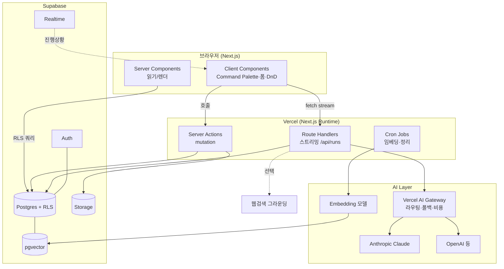
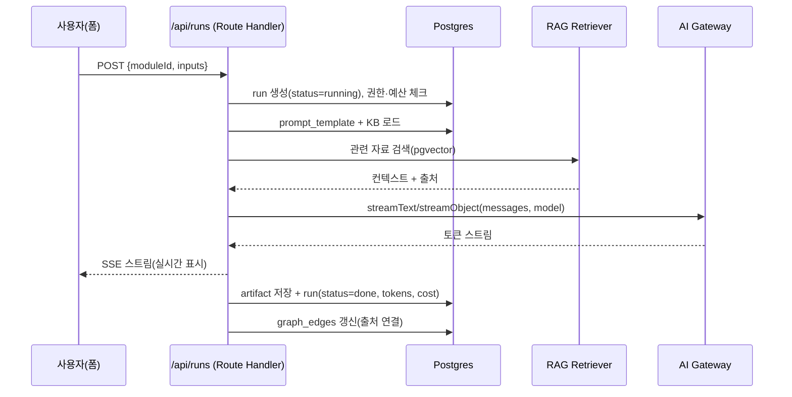

# 02 · System Architecture

> 상위 개념·용어는 [00-README](./00-README.md). 데이터 모델은 [03](./03-database-schema.md), AI 코어는 [05](./05-ai-prompt-engine.md).

---

## 1. 기술 스택 선정 근거

1인 개발 / 빠른 MVP / Production 수준이라는 제약에서 "운영 부담 최소 + 확장 가능"을 동시에 만족하는 조합을 택했다.

| 결정 | 선택 | 근거 | 대안 & 탈락 이유 |
|------|------|------|------------------|
| 프레임워크 | **Next.js 16 (App Router)** | Server Components로 AI 키를 서버에 가두고, Server Actions로 BFF 없이 mutation 처리. 스트리밍 1급 지원. Turbopack 기본·React Compiler 안정으로 DX↑ | Remix(생태계 작음), 분리형 SPA+API(1인엔 과함) |
| 백엔드/DB | **Supabase** | Postgres+Auth+Storage+Realtime+**RLS**를 한 번에. 멀티테넌시를 DB 레벨에서 강제. pgvector로 RAG까지 동일 DB | Firebase(관계형·SQL 약함), 자체 Node+PG(운영부담) |
| AI 추상화 | **Vercel AI SDK v6 + AI Gateway** | 프로바이더 교체가 한 줄. `generateObject`로 구조화 출력. Gateway가 라우팅·폴백·비용추적·예산을 대행 → "멀티 프로바이더 추상화" 요구를 90% 무료로 충족 | LangChain(무겁고 추상화 과함), 직접 SDK(폴백/비용추적 직접 구현) |
| 호스팅 | **Vercel** | Next.js 네이티브, Fluid compute로 긴 AI 스트림에 적합, Cron 내장 | 직접 컨테이너(운영부담) |
| UI | **Tailwind + shadcn/ui** | 코드 소유형(복붙) 컴포넌트라 커스터마이즈 자유. 다크모드·디자인토큰 자연스러움 | MUI(런타임 무겁고 톤 안 맞음) |

> **핵심 원칙:** 운영해야 하는 인프라 컴포넌트 수를 최소화한다. MVP의 외부 의존은 사실상 **Supabase + Vercel + AI Gateway** 3개뿐.

---

## 2. 시스템 컨텍스트 (High-Level)



**핵심 규칙:** AI 프로바이더로 나가는 모든 호출은 **서버(Route Handler/Server Action)** 에서만. 브라우저는 절대 모델 키를 보지 않는다.

---

## 3. 요청 흐름 (대표 3가지)

### 3.1 읽기 (예: 프로젝트 대시보드)
`RSC가 Supabase 클라이언트로 직접 쿼리` → RLS가 workspace 경계 강제 → HTML 스트리밍. 클라이언트 JS 최소.

### 3.2 Module 실행 (인터랙티브, 스트리밍)


### 3.3 원클릭 문서 / Workflow (멀티스텝, 비동기)
짧으면 단일 Route Handler에서 순차 스트리밍. 길면(여러 Module 연쇄) **DB 큐(`runs`)** 에 적재 후 백그라운드 처리(Phase 4: Inngest 도입). 진행상황은 Supabase Realtime으로 푸시.

---

## 4. 폴더 구조 (Next.js App Router)

```
sos/
├─ docs/                          # 본 설계 패키지
├─ src/
│  ├─ app/
│  │  ├─ (marketing)/             # 랜딩/로그인 (비인증)
│  │  ├─ (app)/                   # 인증 영역
│  │  │  ├─ layout.tsx            # 사이드바 + Command Palette 마운트
│  │  │  ├─ w/[workspace]/
│  │  │  │  ├─ p/[project]/
│  │  │  │  │  ├─ knowledge/      # Knowledge Base
│  │  │  │  │  ├─ idea/ research/ validation/ analysis/
│  │  │  │  │  ├─ documents/[doc]/
│  │  │  │  │  ├─ workflows/[wf]/
│  │  │  │  │  ├─ chat/           # AI Chat
│  │  │  │  │  └─ settings/
│  │  │  │  └─ library/           # Prompt Library / Module
│  │  └─ api/
│  │     ├─ runs/route.ts         # Module 실행 스트리밍
│  │     ├─ documents/generate/route.ts
│  │     └─ webhooks/
│  ├─ core/                       # ★ 도메인 코어 (프레임워크 무관)
│  │  ├─ prompt-engine/           # 템플릿 해석·변수·KB 주입  [05]
│  │  ├─ ai/                      # 프로바이더 추상화·모델 정책  [05 §2]
│  │  ├─ rag/                     # 임베딩·검색·출처  [05 §4]
│  │  ├─ modules/                 # 시드 템플릿 정의(SWOT 등)
│  │  ├─ documents/               # 문서 조립기
│  │  └─ schemas/                 # Zod 스키마 (입력/출력/엔티티)
│  ├─ db/
│  │  ├─ migrations/              # SQL 마이그레이션 (= [03])
│  │  ├─ queries/                 # 타입 안전 쿼리 함수
│  │  └─ rls/                     # RLS 정책 SQL
│  ├─ components/                 # shadcn/ui + 도메인 컴포넌트
│  ├─ lib/                        # supabase client, auth, utils
│  └─ types/
├─ supabase/                      # supabase config, seed
└─ ...
```

> **`src/core`가 핵심.** 프롬프트 엔진·AI·RAG·모듈 정의는 Next.js에 의존하지 않는 순수 TS로 둬서 테스트와 재사용을 쉽게 한다. app/api는 얇은 어댑터.

---

## 5. 인증 & 멀티테넌시

- **인증:** Supabase Auth (이메일 매직링크 + OAuth). 세션은 `@supabase/ssr`로 쿠키 기반, 미들웨어에서 갱신.
- **테넌트 경계:** 모든 핵심 테이블에 `workspace_id`. **RLS가 진실의 원천** — 앱 코드 버그가 있어도 DB가 타 워크스페이스 데이터를 막는다.
- **권한 모델(MVP):** `owner / member`. v2에서 `admin / viewer / billing` 확장.
- **AI 호출 컨텍스트:** Route Handler는 사용자 세션으로 RLS 적용 쿼리. 서버 전용 작업(임베딩 배치)만 `service_role` 사용하되 코드 경로를 분리.

자세한 RLS 정책은 [03 §5](./03-database-schema.md).

---

## 6. 보안

| 영역 | 조치 |
|------|------|
| 비밀키 | 모델/서비스 키는 서버 환경변수만. `NEXT_PUBLIC_*` 에 절대 금지 |
| 데이터 격리 | RLS 기본 deny, 정책으로만 허용. 모든 테이블 `enable row level security` |
| 프롬프트 인젝션 | 사용자 KB/입력은 메시지 내 **데이터 블록**으로 명시 구분, 시스템 프롬프트가 우선. 출력은 스키마 검증 |
| 비용 남용 | Workspace별 토큰/요청 예산, 사용자별 rate limit(`@upstash/ratelimit` 또는 Gateway 예산) |
| Storage | 버킷별 RLS, 서명 URL로만 접근 |
| 감사 | `runs`/`reviews`에 actor·input·cost 기록 → 감사 추적 |
| PII | KB에 개인정보 최소화 권고, 삭제 시 cascade + Storage 정리 |

---

## 7. 배포 · 환경

- **환경:** `local`(Supabase CLI) → `preview`(PR마다 Vercel + Supabase branch) → `production`.
- **마이그레이션:** `supabase/migrations` 단방향 SQL, CI에서 적용. 롤백은 보상 마이그레이션.
- **시드:** 시스템 Module 템플릿(SWOT 등)은 마이그레이션/seed로 주입 → 코드 배포와 분리해 템플릿만 업데이트 가능.

### 7.1 환경변수 (요약)

```
# Supabase
NEXT_PUBLIC_SUPABASE_URL=
NEXT_PUBLIC_SUPABASE_ANON_KEY=
SUPABASE_SERVICE_ROLE_KEY=        # 서버 전용

# AI (Vercel AI Gateway 경유 권장 → 단일 키)
GOOGLE_GENERATIVE_AI_API_KEY=
# (BYOK 시) ANTHROPIC_API_KEY= / OPENAI_API_KEY=

# 임베딩
EMBEDDING_MODEL=gemini-embedding-001   # 1536d, halfvec 저장

# 기타
APP_URL=
RATE_LIMIT_REDIS_URL=             # 선택(Upstash)
```

---

## 8. 관측성 (Observability)

- **AI 사용량/비용:** AI Gateway 대시보드 + 자체 `runs.tokens_*`, `runs.cost_usd` 집계. Workspace별 비용 리포트.
- **에러:** Sentry(클라이언트+서버). AI 파싱/스키마 실패는 별도 카테고리로 추적(품질 지표).
- **제품 분석:** PostHog — Activation 퍼널(가입→첫 Artifact), 모듈별 실행수, 👍/👎.
- **로그:** 구조화 로그(run_id 상관). 민감정보(프롬프트 본문) 로깅 정책 분리.

---

## 9. 성능 예산

- p95 첫 토큰 < 3s, 평균 Module 완료 < 30s, 초기 페이지 TTFB < 500ms(RSC).
- 전략: RSC 우선·클라이언트 번들 최소, 스트리밍 응답, Optimistic UI, RAG 검색 < 100ms(HNSW), 결과 캐시([05 §8](./05-ai-prompt-engine.md)).

---

## 10. 빌드 vs 사기 (Build vs Buy)

| 기능 | 결정 |
|------|------|
| 멀티 프로바이더 라우팅·폴백·비용 | **Buy** (AI Gateway) — 직접 구현 낭비 |
| 인증·DB·스토리지·실시간 | **Buy** (Supabase) |
| 프롬프트 엔진·KB 주입·모듈 모델 | **Build** — 여기가 SOS의 차별화 자산 |
| RAG 파이프라인 | **Build (얇게)** — pgvector 위에 단순 검색. 외부 벡터DB 불필요 |
| 결제(v2) | **Buy** (Stripe / Lemon Squeezy) |
