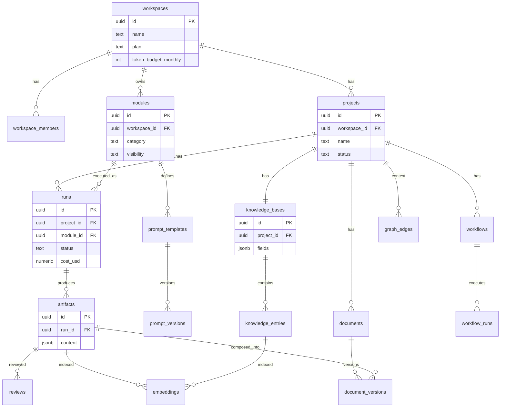

# 03 · Database Schema (Postgres / Supabase)

> 용어는 [00-README §3](./00-README.md). 모든 테이블은 `workspace_id` 기준 RLS로 격리된다.

DDL은 `supabase/migrations`에 그대로 사용할 수 있는 형태로 작성했다. (요약본 — 실제 적용 시 트리거/제약 보강)

---

## 1. ERD



---

## 2. 확장 & 공통 규약

```sql
create extension if not exists "pgcrypto";   -- gen_random_uuid
create extension if not exists "vector";     -- pgvector (RAG)

-- 공통: 모든 테이블 created_at/updated_at, updated_at 자동 갱신 트리거
create or replace function set_updated_at() returns trigger as $$
begin new.updated_at = now(); return new; end; $$ language plpgsql;
```

규약: PK는 `uuid default gen_random_uuid()`, 시간은 `timestamptz`, 가변/확장 데이터는 `jsonb`, 열거형은 `text + check`(MVP 단순화; 안정화 후 enum 전환).

---

## 3. 핵심 테이블 DDL

### 3.1 Workspace & 멤버

```sql
create table workspaces (
  id uuid primary key default gen_random_uuid(),
  name text not null,
  plan text not null default 'free' check (plan in ('free','pro','team')),
  token_budget_monthly bigint not null default 2000000,  -- 비용 가드레일
  tokens_used_current bigint not null default 0,
  created_at timestamptz not null default now(),
  updated_at timestamptz not null default now()
);

create table workspace_members (
  workspace_id uuid not null references workspaces(id) on delete cascade,
  user_id uuid not null references auth.users(id) on delete cascade,
  role text not null default 'member' check (role in ('owner','member')),
  created_at timestamptz not null default now(),
  primary key (workspace_id, user_id)
);
create index on workspace_members(user_id);
```

### 3.2 Project & Knowledge Base

```sql
create table projects (
  id uuid primary key default gen_random_uuid(),
  workspace_id uuid not null references workspaces(id) on delete cascade,
  name text not null,
  description text,
  status text not null default 'active' check (status in ('active','archived')),
  created_by uuid references auth.users(id),
  created_at timestamptz not null default now(),
  updated_at timestamptz not null default now()
);
create index on projects(workspace_id);

-- 프로젝트당 정확히 1개의 KB (unique)
create table knowledge_bases (
  id uuid primary key default gen_random_uuid(),
  project_id uuid not null unique references projects(id) on delete cascade,
  workspace_id uuid not null references workspaces(id) on delete cascade,
  -- 구조화 필드: 프로젝트명/서비스설명/시장/타겟/문제/솔루션/경쟁사/BM/기술스택/수익모델/USP
  fields jsonb not null default '{}'::jsonb,
  updated_at timestamptz not null default now()
);

-- 자유 지식 항목(문서/메모/업로드) — RAG 대상
create table knowledge_entries (
  id uuid primary key default gen_random_uuid(),
  knowledge_base_id uuid not null references knowledge_bases(id) on delete cascade,
  workspace_id uuid not null references workspaces(id) on delete cascade,
  title text,
  body text,                     -- 본문(청킹·임베딩 대상)
  source_type text default 'note' check (source_type in ('note','upload','web','artifact')),
  source_url text,
  storage_path text,             -- Supabase Storage 경로(업로드 시)
  created_at timestamptz not null default now()
);
create index on knowledge_entries(knowledge_base_id);
```

> **`fields` jsonb 설계:** 구조화 필드는 자주 바뀌므로 컬럼이 아닌 jsonb로. 키는 코드 상수로 고정(`market`,`target`,`problem`,`solution`,`competitors`,`business_model`,`tech_stack`,`revenue_model`,`usp`...). 프롬프트 엔진이 이 키들을 KB 변수로 자동 주입한다([05 §3](./05-ai-prompt-engine.md)).

### 3.3 Module & Prompt Template (Prompt First의 심장)

```sql
create table modules (
  id uuid primary key default gen_random_uuid(),
  workspace_id uuid references workspaces(id) on delete cascade, -- null = 시스템 기본 제공
  category text not null check (category in
    ('idea','research','validation','analysis','document','custom')),
  key text,                       -- 'swot','tam_sam_som' (시스템 모듈 식별)
  name text not null,
  description text,
  icon text,
  visibility text not null default 'private'
    check (visibility in ('system','private','workspace')), -- workspace=팀 템플릿 마켓
  created_by uuid references auth.users(id),
  created_at timestamptz not null default now(),
  updated_at timestamptz not null default now()
);
create unique index on modules(key) where visibility = 'system';
create index on modules(workspace_id, category);

-- 현재 활성 템플릿(헤더). 본문 버전은 prompt_versions
create table prompt_templates (
  id uuid primary key default gen_random_uuid(),
  module_id uuid not null references modules(id) on delete cascade,
  current_version_id uuid,        -- prompt_versions.id (순환참조라 FK는 deferrable)
  output_kind text not null default 'structured'
    check (output_kind in ('structured','markdown','document')),
  created_at timestamptz not null default now()
);

create table prompt_versions (
  id uuid primary key default gen_random_uuid(),
  prompt_template_id uuid not null references prompt_templates(id) on delete cascade,
  version int not null,
  system_prompt text not null,            -- System Prompt
  instructions text not null,             -- Instructions
  variables jsonb not null default '[]',  -- Variables(입력 스키마) — 아래 구조
  output_format jsonb not null default '{}',  -- Output Format(스키마/섹션)
  examples jsonb not null default '[]',   -- few-shot Examples
  model_policy jsonb,                     -- 선호 모델/온도 등(없으면 기본 정책)
  changelog text,
  created_by uuid references auth.users(id),
  created_at timestamptz not null default now(),
  unique (prompt_template_id, version)
);
```

**`variables` jsonb 구조(예):**

```jsonc
[
  { "key": "market",      "label": "시장",   "type": "text",        "source": "kb:market", "required": true },
  { "key": "target",      "label": "타겟",   "type": "textarea",    "source": "kb:target" },
  { "key": "competitors", "label": "경쟁사", "type": "multiselect",  "source": "kb:competitors", "options": [] },
  { "key": "tone",        "label": "톤앤매너","type": "select",      "options": ["전문적","간결","설득적"] },
  { "key": "length",      "label": "출력길이","type": "slider",      "min": 1, "max": 5, "default": 3 },
  { "key": "language",    "label": "언어",    "type": "language",    "default": "ko" }
]
```

`source: "kb:<field>"` 가 있으면 폼이 **KB 값으로 자동 채움** → "같은 내용 반복 입력 없음" 요구 충족.

### 3.4 Run & Artifact (실행과 결과)

```sql
create table runs (
  id uuid primary key default gen_random_uuid(),
  workspace_id uuid not null references workspaces(id) on delete cascade,
  project_id uuid not null references projects(id) on delete cascade,
  module_id uuid not null references modules(id),
  prompt_version_id uuid references prompt_versions(id),
  status text not null default 'queued'
    check (status in ('queued','running','succeeded','failed','canceled')),
  inputs jsonb not null default '{}',     -- 사용자 입력 스냅샷
  resolved_messages jsonb,                -- 실제 전송된 메시지(재현·감사용)
  rag_sources jsonb default '[]',         -- 참조 출처(provenance)
  provider text, model text,
  tokens_in int default 0, tokens_out int default 0,
  cost_usd numeric(10,5) default 0,
  error text,
  workflow_run_id uuid,                    -- 워크플로우에서 실행된 경우
  created_by uuid references auth.users(id),
  created_at timestamptz not null default now(),
  finished_at timestamptz
);
create index on runs(project_id, created_at desc);
create index on runs(workspace_id, created_at desc);

create table artifacts (
  id uuid primary key default gen_random_uuid(),
  workspace_id uuid not null references workspaces(id) on delete cascade,
  project_id uuid not null references projects(id) on delete cascade,
  run_id uuid references runs(id) on delete set null,
  module_id uuid references modules(id),
  title text,
  kind text not null default 'analysis'
    check (kind in ('idea','research','validation','analysis','document_section')),
  content jsonb not null,                  -- 구조화 결과(output_format 준수)
  content_md text,                         -- 렌더용 마크다운 캐시
  pinned boolean default false,            -- KB 우선 컨텍스트로 고정
  feedback smallint,                       -- 👍 1 / 👎 -1
  created_at timestamptz not null default now()
);
create index on artifacts(project_id, kind, created_at desc);
```

### 3.5 Document & 버전

```sql
create table documents (
  id uuid primary key default gen_random_uuid(),
  workspace_id uuid not null references workspaces(id) on delete cascade,
  project_id uuid not null references projects(id) on delete cascade,
  doc_type text not null,        -- 'biz_plan','ir_deck','one_pager','tips' ...
  title text not null,
  current_version_id uuid,
  created_at timestamptz not null default now(),
  updated_at timestamptz not null default now()
);

create table document_versions (
  id uuid primary key default gen_random_uuid(),
  document_id uuid not null references documents(id) on delete cascade,
  version int not null,
  -- 섹션 배열: 각 섹션이 artifact 참조 또는 인라인 본문
  sections jsonb not null default '[]',
  body_md text,                  -- 합성된 전체 마크다운(Export 소스)
  created_by uuid references auth.users(id),
  created_at timestamptz not null default now(),
  unique (document_id, version)
);
```

### 3.6 Workflow

```sql
create table workflows (
  id uuid primary key default gen_random_uuid(),
  workspace_id uuid not null references workspaces(id) on delete cascade,
  project_id uuid references projects(id) on delete cascade,
  name text not null,
  -- 노드/엣지(DAG): [{id, module_id, input_map}], edges:[{from,to}]
  graph jsonb not null default '{"nodes":[],"edges":[]}',
  created_at timestamptz not null default now()
);

create table workflow_runs (
  id uuid primary key default gen_random_uuid(),
  workflow_id uuid not null references workflows(id) on delete cascade,
  project_id uuid not null references projects(id) on delete cascade,
  status text not null default 'running'
    check (status in ('running','succeeded','failed','canceled')),
  step_states jsonb not null default '{}',  -- 노드별 상태/run_id
  created_at timestamptz not null default now(),
  finished_at timestamptz
);
```

### 3.7 Reviewer

```sql
create table reviews (
  id uuid primary key default gen_random_uuid(),
  workspace_id uuid not null references workspaces(id) on delete cascade,
  artifact_id uuid references artifacts(id) on delete cascade,
  document_id uuid references documents(id) on delete cascade,
  persona text not null check (persona in ('investor','judge','customer','competitor')),
  score numeric(4,2),            -- 0~10
  strengths jsonb, weaknesses jsonb, suggestions jsonb,
  run_id uuid references runs(id),
  created_at timestamptz not null default now()
);
```

---

## 4. RAG: 임베딩 & Knowledge Graph

```sql
-- 통합 임베딩 테이블(다형 소스). halfvec(1536) — 2026 권장
create table embeddings (
  id uuid primary key default gen_random_uuid(),
  workspace_id uuid not null references workspaces(id) on delete cascade,
  project_id uuid not null references projects(id) on delete cascade,
  source_type text not null check (source_type in ('knowledge_entry','artifact','document')),
  source_id uuid not null,
  chunk_index int not null default 0,
  content text not null,         -- 청크 원문(512토큰/50오버랩)
  embedding halfvec(1536) not null,
  created_at timestamptz not null default now()
);
-- HNSW: cosine, p99 < 10ms (~5M vectors)
create index on embeddings using hnsw (embedding halfvec_cosine_ops);
create index on embeddings(project_id, source_type);

-- Knowledge Graph: 엔티티 간 관계(맥락·출처)
create table graph_edges (
  id uuid primary key default gen_random_uuid(),
  workspace_id uuid not null references workspaces(id) on delete cascade,
  project_id uuid not null references projects(id) on delete cascade,
  from_type text not null, from_id uuid not null,   -- run/artifact/document/kb_entry
  to_type text not null,   to_id uuid not null,
  relation text not null,  -- 'derived_from','cites','part_of','reviews'
  weight real default 1.0,
  created_at timestamptz not null default now()
);
create index on graph_edges(project_id, from_id);
create index on graph_edges(project_id, to_id);
```

**검색 함수(RPC):**

```sql
create or replace function match_chunks(
  p_project uuid, p_query halfvec(1536), p_k int default 8
) returns table (source_type text, source_id uuid, content text, similarity float)
language sql stable as $$
  select source_type, source_id, content,
         1 - (embedding <=> p_query) as similarity
  from embeddings
  where project_id = p_project
  order by embedding <=> p_query
  limit p_k;
$$;
```

> RLS가 `embeddings`에도 적용되므로 검색 결과는 자동으로 권한 범위로 제한된다(RAG-with-permissions).

---

## 5. RLS 정책 (핵심)

원칙: **기본 deny → 멤버십 기반 허용.** 헬퍼 함수로 중복 제거.

```sql
-- 현재 유저가 속한 workspace 인가?
create or replace function is_member(ws uuid) returns boolean
language sql stable security definer set search_path = public as $$
  select exists (
    select 1 from workspace_members m
    where m.workspace_id = ws and m.user_id = auth.uid()
  );
$$;

-- 모든 핵심 테이블에 적용
alter table projects enable row level security;
create policy "member can read"   on projects for select using (is_member(workspace_id));
create policy "member can write"  on projects for all
  using (is_member(workspace_id)) with check (is_member(workspace_id));

-- 동일 패턴을 knowledge_bases / knowledge_entries / runs / artifacts /
-- documents / document_versions / workflows / embeddings / graph_edges / reviews 에 반복.

-- modules: 시스템 모듈은 전원 읽기, 워크스페이스 모듈은 멤버만
alter table modules enable row level security;
create policy "read system or own ws" on modules for select
  using (visibility = 'system' or is_member(workspace_id));
create policy "write own ws" on modules for all
  using (is_member(workspace_id)) with check (is_member(workspace_id));

-- workspace_members: 본인이 속한 워크스페이스 멤버 목록만
alter table workspace_members enable row level security;
create policy "see co-members" on workspace_members for select
  using (is_member(workspace_id));
```

> `security definer` 헬퍼는 RLS 재귀를 피한다. `search_path` 고정은 보안 필수.

---

## 6. 비용 가드레일 (DB 레벨)

```sql
-- run 완료 시 워크스페이스 누적 토큰 갱신 + 예산 초과 차단은 앱에서 사전 체크,
-- 사후 집계는 트리거로 정확도 보장
create or replace function bump_usage() returns trigger as $$
begin
  if new.status = 'succeeded' and old.status <> 'succeeded' then
    update workspaces
      set tokens_used_current = tokens_used_current + new.tokens_in + new.tokens_out
      where id = new.workspace_id;
  end if;
  return new;
end; $$ language plpgsql;
create trigger trg_bump_usage after update on runs
  for each row execute function bump_usage();
```

---

## 7. 마이그레이션 순서

1. extensions + 공통 함수
2. workspaces → workspace_members
3. projects → knowledge_bases → knowledge_entries
4. modules → prompt_templates → prompt_versions
5. runs → artifacts
6. documents → document_versions
7. workflows → workflow_runs
8. embeddings → graph_edges → reviews + RPC
9. RLS 일괄 적용
10. seed: 시스템 Module 템플릿(SWOT 등 15개, [05 부록])
