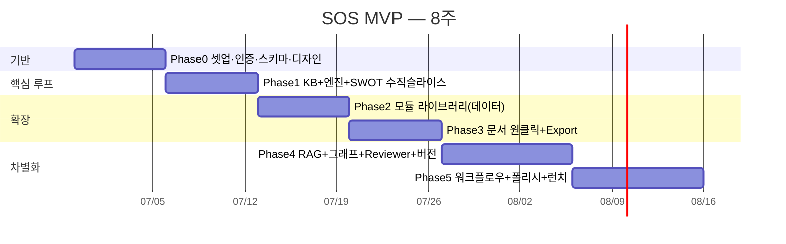
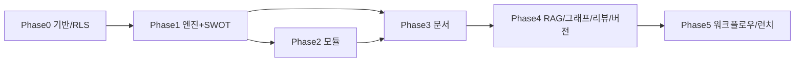

# 07 · 실행 로드맵 (1인 / 빠른 MVP)

> 목표: **8주 안에 "가입→KB→SWOT→사업계획서→Export"가 막힘 없이 도는 Production MVP.** 상위 범위는 [01-PRD §6](./01-PRD.md).

---

## 1. 실행 원칙 (1인 개발자용)

1. **수직 슬라이스 먼저.** 모듈 1개(SWOT)를 입력부터 저장까지 끝까지 관통시킨다. 그 다음은 "데이터(템플릿) 추가"로 확장 — 코드가 아니라.
2. **기능 = 데이터.** 새 분석 프레임워크/문서는 `prompt_versions` 레코드. 이 구조 덕에 1인이 20+ 기능을 감당한다.
3. **사지 말고 빌릴 것은 빌린다.** 인증/DB/RLS=Supabase, 라우팅/폴백/비용=AI Gateway. 직접 만들지 않는다([02 §10](./02-architecture.md)).
4. **매주 배포 가능 상태 유지.** 각 Phase 끝에 데모 가능한 무언가가 production에 있다.
5. **컷라인을 미리 정한다(§4).** 뒤처지면 기능을 빼되 핵심 루프는 지킨다.

---

## 2. 단계별 계획 (8주)

### Phase 0 — 기반 (1주) · "빈 앱이 배포된다"
- 레포 + Next.js 16(App Router, TS) + Tailwind + shadcn/ui + 다크 토큰([06 §4](./06-ux-and-screens.md)).
- Supabase 프로젝트, `@supabase/ssr` 인증(매직링크), 미들웨어 세션.
- 마이그레이션 1–9 적용([03 §7](./03-database-schema.md)), **RLS 켜고 검증**.
- 앱 셸: 사이드바 + `Cmd+K` 팔레트(빈 동작) + Workspace/Project 생성.
- Vercel 배포 + 환경변수([02 §7.1](./02-architecture.md)) + Sentry/PostHog 연결.
- **DoD:** 로그인→워크스페이스/프로젝트 생성→빈 대시보드, production에서 동작.

### Phase 1 — 핵심 루프 수직 슬라이스 (1주) · "SWOT가 끝까지 돈다" ★
- `core/prompt-engine`(resolveVariables/renderMessages) + `core/ai`(gateway/policy/execute)([05 §2–3](./05-ai-prompt-engine.md)).
- Knowledge Base 화면(구조화 필드 + Auto Save).
- `VariableForm`(스키마→폼 자동 생성) + `ModuleRunner` + `ResultRenderer`(SWOT 4분면).
- `POST /api/runs` 스트리밍(structured `streamObject`) → `artifacts` 저장 → 토큰/비용 기록 + 예산 사전 체크.
- 시드: SWOT 1개.
- **DoD:** KB 입력 → SWOT 실행(스트리밍) → 결과 저장 → 재조회. AI 키 서버에서만.

### Phase 2 — 모듈 라이브러리 확장 (1주) · "프레임워크가 늘어난다"
- 시드 Module 15개 주입([05 부록 A](./05-ai-prompt-engine.md)): Analysis 8 + Research 3 + Idea 2 + Validation 2.
- 카테고리별 라우트(idea/research/validation/analysis)는 **같은 ModuleRunner 재사용**.
- 출력 렌더러: 캔버스형(Lean/BMC), 리스트형, 점수형(PMF) 추가.
- Artifact 리스트/상세, 피드백(👍/👎), "KB에 저장".
- **DoD:** 15개 모듈이 데이터만으로 동작. 새 모듈 추가에 신규 화면 코드 불필요.

### Phase 3 — 문서 원클릭 + Export (1주) · "사업계획서가 나온다"
- 문서 프리셋 정의(One Pager, Executive Summary, 사업계획서[정부지원]).
- `POST /api/documents/generate`: 섹션별 Module 연쇄 스트리밍 → `documents`+`document_versions`.
- Documents 화면: 섹션 아웃라인(DnD), 섹션 재생성/보강, 인서트 패널.
- Export: Markdown(즉시) → PDF → (PPTX는 Phase 5). 서버 변환.
- **DoD:** KB만 채워져 있으면 사업계획서 초안 1클릭 생성 + PDF Export.

### Phase 4 — 차별화 1: 근거·기억·평가 (1.5주)
- RAG: 청킹·임베딩(Cron 배치) + `match_chunks` + `<context>` 주입 + **출처 칩**([05 §4](./05-ai-prompt-engine.md)).
- Knowledge Graph: 엣지 기록 + Project Memory 리스트/타임라인 뷰.
- AI Reviewer: 4페르소나 평가 + 레이더 + "제안 반영"([05 §7](./05-ai-prompt-engine.md)).
- 버전 관리: 프롬프트/문서 버전 저장·diff·복원([04 §5](./04-api-design.md)).
- **DoD:** 결과에 출처 표시, 문서 투자자 리뷰, 문서 버전 비교/복원.

### Phase 5 — 차별화 2 + 런치 (1.5주)
- Workflow: 프리셋 파이프라인 실행 + Realtime 진행 표시(빌더는 차후).
- Prompt Library: 사용자 Module 제작·라이브 프리뷰·팀 공유(visibility=workspace).
- 폴리시: 빈 상태, 에러 UX, 반응형, 접근성, 성능 예산 점검([02 §9](./02-architecture.md)).
- 결제(선택, Lemon Squeezy/Stripe) + 사용량 한도.
- **DoD:** §6 런치 체크리스트 통과 → 베타 오픈.

---

## 3. 의존성 순서 (무엇이 무엇을 막나)

엔진(P1)이 모든 것의 병목 → **여기 품질에 시간을 가장 많이 써라.**

---

## 4. 컷라인 (뒤처질 때 버리는 순서)

위에서부터 버린다. 핵심 루프(가입→KB→모듈→문서→Export)는 절대 사수.

1. Workflow 빌더 UI(프리셋만 유지) → v2
2. Knowledge Graph **시각화**(엣지 기록·리스트는 유지)
3. PPTX Export(MD/PDF만)
4. 결제(수동 초대/무료 베타로 출발)
5. Reviewer 4관점 중 2관점(investor/judge만)
6. 버전 **diff UI**(버전 저장·복원은 유지)

---

## 5. 비용 모델 (러프 추정)

가정: MVP 베타 활성 사용자 50명, 사용자당 주 20 runs, run당 평균 입력 2.5k/출력 3k 토큰, 라우팅으로 70% Sonnet·20% Haiku·10% Opus.

- 월 runs ≈ 50 × 20 × 4 = 4,000.
- 라우팅·캐싱 적용 시 **AI 비용 대략 월 수십~백수십 달러 규모**(모델 단가는 변동 → AI Gateway 대시보드로 실측·예산 한도 설정이 정답).
- 인프라: Supabase Pro + Vercel Pro로 **월 약 $45–70** 수준에서 시작.
- **결론:** 비용 리스크의 핵심은 AI. ① 모델 라우팅 ② 프롬프트 캐싱 ③ 워크스페이스 토큰 예산 ④ 결과 캐시 4종으로 통제([05 §8](./05-ai-prompt-engine.md)). 실단가는 출시 직전 Gateway에서 재확인.

---

## 6. 런치 체크리스트

- [ ] 핵심 루프 E2E 통과(가입→KB→SWOT→사업계획서→PDF).
- [ ] 동일 정보 2회 입력 없음(KB 자동주입 검증).
- [ ] 모든 AI 호출 서버 전용, 키 미노출(네트워크 탭 점검).
- [ ] RLS: 타 워크스페이스 데이터 접근 0(다계정 테스트).
- [ ] 예산 초과·프로바이더 실패 시 graceful UX.
- [ ] p95 첫 토큰 < 3s, 평균 모듈 < 30s.
- [ ] 모바일 읽기/실행 비파손.
- [ ] Sentry 0 크리티컬, PostHog Activation 퍼널 수집.
- [ ] 개인정보/약관, 데이터 삭제 경로.
- [ ] 시드 모듈 품질 리뷰(few-shot 점검).

---

## 7. 어떻게 진행하면 좋은가 (실전 워크플로우)

1. **이 문서 패키지를 레포의 사양서로 고정.** `docs/`를 단일 출처로 삼고, 구현 중 결정이 바뀌면 문서를 먼저 갱신.
2. **Phase 0를 지금 시작.** "다음 단계"에서 내가 ① Next.js+Supabase 스캐폴딩 ② 마이그레이션 SQL ③ `core/` 골격 ④ ModuleRunner+SWOT 수직 슬라이스 순으로 실제 코드를 생성해줄 수 있다.
3. **수직 슬라이스(Phase 1)에 집중.** SWOT가 끝까지 돌면 나머지는 템플릿 추가 + 렌더러 추가의 반복이라 속도가 붙는다.
4. **매주 금요일 배포 + 셀프 도그푸딩.** 본인의 다른 아이디어로 SOS를 직접 써보며 막히는 지점을 우선순위화.
5. **시드 프롬프트 품질에 투자.** 모듈은 데이터라 쉽게 늘지만, 결과 품질=프롬프트 품질. few-shot 예시 1–2개를 꼭 넣어라.
6. **계측을 1일차부터.** Activation 퍼널·실패율·비용을 처음부터 보면 컷라인 판단이 정확해진다.

---

## 8. MVP 이후 (v2 후보)

실시간 협업 편집, 공개 Template Market, Reddit/뉴스 실시간 파이프라인, Workflow DnD 빌더, 모바일 앱, 다국어 출력 고도화, 팀 권한(admin/viewer/billing), 외부 데이터 커넥터(시장 통계 API).

---

## 다음 액션 (바로 선택)

원하시면 이어서 **Phase 0 스캐폴딩을 실제 코드로 생성**합니다:
- (a) Next.js 16 + Tailwind + shadcn/ui + Supabase 클라이언트/미들웨어 보일러플레이트
- (b) `supabase/migrations` 전체 SQL([03](./03-database-schema.md) 기준)
- (c) `core/` 골격(prompt-engine·ai·schemas) + SWOT 시드 + ModuleRunner 수직 슬라이스

"a부터 시작" 처럼 말씀해주시면 그 순서로 만들어 드립니다.
